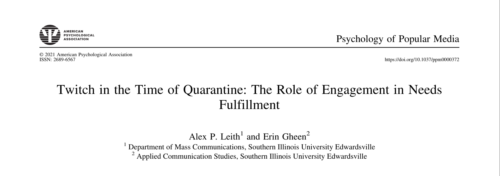
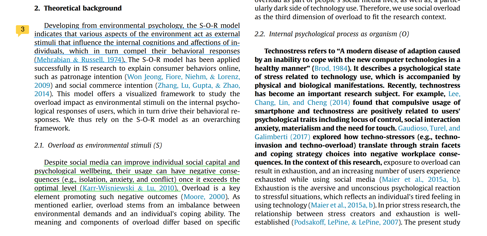
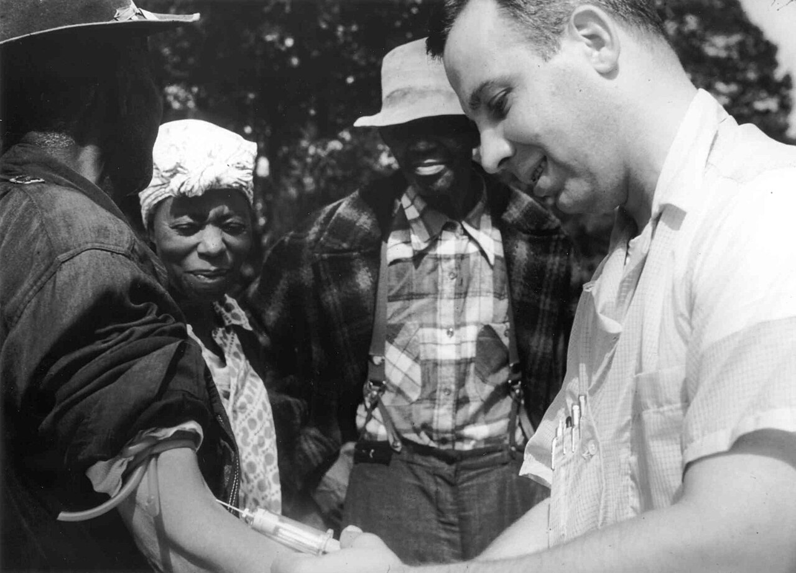

# **An Introduction to Social Science Research**

## Introduction to Social Science Research

Social science research serves as a powerful tool for exploring and understanding the complexities of human behavior, societal interactions, and cultural dynamics. It is a systematic approach to answering questions about how individuals and groups think, act, and interact within various social contexts. Unlike natural sciences, which focus on physical and biological processes, social science research examines social phenomena, aiming to uncover patterns, relationships, and causal mechanisms that explain human and societal behavior. Through rigorous methodologies, social science research generates reliable and actionable insights that inform policy, enhance organizational strategies, and deepen our understanding of social structures.

### The Role of Social Science Research in Mass Communication {.unnumbered}

In the field of mass communication and media studies, social science research is fundamental. It examines how media shapes public opinion, influences behavior, and reflects cultural values. For instance, surveys and experiments often explore audience reactions to political advertisements, while longitudinal studies investigate the effects of prolonged social media use on mental health. Content analysis is a common method used to identify patterns in media representation, such as portrayals of gender, race, or climate change, revealing biases and trends that influence societal attitudes. These findings not only expand academic knowledge but also guide media professionals, policymakers, and educators in addressing societal challenges and engaging audiences effectively.

### Practical Applications of Social Science Research {.unnumbered}

The impact of social science research extends well beyond academia. It serves as a foundation for evidence-based decision-making across diverse sectors, including healthcare, education, and public policy. For example: - **Public Health Communication**: Research during crises like the COVID-19 pandemic has highlighted the importance of clear, accurate messaging in building public trust and compliance with health guidelines. - **Misinformation and Digital Media**: Studies on the spread of misinformation have informed strategies to counteract false narratives, protecting democratic institutions and enhancing public discourse. - **Educational Strategies**: Research on media literacy has helped educators design programs that teach critical thinking skills for navigating the complexities of digital information.

By identifying trends, testing theories, and proposing solutions to pressing issues, social science research plays a vital role in addressing global challenges and improving societal outcomes.

### Ethical Foundations of Social Science Research {.unnumbered}

Ethical principles are at the core of social science research, ensuring that studies are conducted with respect for participants and with an emphasis on minimizing harm while maximizing benefits. This focus on ethics emerged in response to historical instances of unethical research, such as the Tuskegee Syphilis Study, which caused significant harm and violated participants' rights. Today, institutional review boards (IRBs) and frameworks like the **Belmont Report** provide ethical guidance, emphasizing: 1. **Respect for Persons**: Ensuring informed consent and safeguarding participants' autonomy. 2. **Beneficence**: Designing studies to maximize benefits and minimize harm. 3. **Justice**: Ensuring fair treatment and equitable distribution of research risks and benefits.

These principles are particularly critical in media research, where studies may involve sensitive topics like privacy, media representation, or the psychological effects of media exposure.

### The Systematic Approach of Social Science Research {.unnumbered}

Social science research is characterized by its structured methodology, encompassing several interconnected stages: 1. **Identifying a Research Question**: This step focuses the inquiry on a specific issue or phenomenon. 2. **Reviewing Existing Literature**: Researchers build on prior knowledge to contextualize their study and refine their focus. 3. **Designing the Study**: This includes selecting appropriate methods, defining variables, and determining a sample. 4. **Data Collection**: Methods such as surveys, interviews, experiments, or content analysis are used to gather information. 5. **Data Analysis**: Researchers employ statistical or qualitative techniques to identify patterns and draw conclusions. 6. **Disseminating Findings**: Results are shared through academic publications, presentations, or public reports, contributing to ongoing discussions and future research.

{width="100%"}

This systematic process ensures the reliability, validity, and relevance of research findings, enabling scholars to make meaningful contributions to their fields.

### Advancing Knowledge and Addressing Complex Issues {.unnumbered}

Social science research is indispensable for examining and addressing complex social issues. In mass communication and media studies, it provides insights into audience behavior, media effects, and cultural trends, shaping how we understand and interact with the world. By adhering to ethical principles and employing systematic methods, researchers ensure their work advances both theoretical knowledge and practical applications, benefiting industries and communities alike.

As you progress through this course, you will develop the skills necessary to engage in social science research. These skills will empower you to contribute meaningfully to the fields of mass communication and media studies, equipping you to analyze, interpret, and address the dynamic challenges of contemporary society.

## History of Social Science Research

The history of social science research reflects its growth as a systematic discipline focused on understanding human behavior, societal interactions, and cultural dynamics. Evolving from its philosophical roots, social science research has developed into an empirical and interdisciplinary field, combining qualitative and quantitative approaches to address complex social phenomena. Examining its historical trajectory reveals the milestones and challenges that have shaped its methodologies, ethics, and applications.

### Early Foundations: From Philosophy to Empirical Inquiry {.unnumbered}

The origins of social science research lie in philosophy and early social observation. Thinkers such as Aristotle and Confucius pondered human behavior and societal structures, but their approaches were often speculative rather than systematic. The Enlightenment era introduced a shift toward reason and empirical inquiry, laying the groundwork for modern social science. Early pioneers like **Auguste Comte**, who coined the term "sociology," and **Emile Durkheim** emphasized the use of scientific methods to study social phenomena. Their work established sociology as a distinct discipline, advocating for empirical research over abstract theorization.

### The 19th and Early 20th Centuries: Methodological Advances {.unnumbered}

During the 19th and early 20th centuries, social science research matured through the adoption of structured methodologies and statistical analysis. The development of surveys enabled researchers to gather data on public opinion and behavior systematically. The **Chicago School of Sociology** was instrumental in advancing social science research, integrating fieldwork and qualitative methods like ethnography and participant observation to explore urban life and social structures.

This period also marked the diversification of research approaches, with the emergence of quantitative tools such as census analysis and correlation studies. These advancements allowed social scientists to study large-scale societal trends while addressing individual and community-level dynamics.

### Mid-20th Century: Ethical Challenges and Theoretical Breakthroughs {.unnumbered}

The mid-20th century was characterized by groundbreaking studies and significant ethical challenges. Notable examples include:

-   **Stanley Milgram's Obedience Experiments**: These studies provided profound insights into human psychology by examining how individuals comply with authority, even when it conflicts with their moral values. However, they sparked debates about the psychological distress caused to participants.

{width="100%"}

-   **Philip Zimbardo's Stanford Prison Experiment**: This research highlighted the influence of situational factors on behavior but faced criticism for the ethical issues surrounding participant harm and lack of informed consent.

[{width="100%"}](https://www.prisonexp.org/)

These ethical dilemmas prompted the establishment of formal guidelines, including the **Belmont Report**, which emphasized respect for persons, beneficence, and justice in research. Institutional Review Boards (IRBs) were created to ensure that studies involving human participants adhere to these principles.

### Mass Communication Research in the Mid-20th Century {.unnumbered}

The rise of mass media technologies, including radio, television, and newspapers, fueled significant advancements in communication research. Studies explored the effects of media on public opinion, behavior, and societal perceptions. Key contributions included:

-   **Paul Lazarsfeld's Two-Step Flow Model**: This theory highlighted the role of opinion leaders in mediating media messages, demonstrating that mass communication often influences audiences indirectly.
-   **Walter Lippmann's Public Opinion**: Lippmann analyzed how media shapes societal perceptions, introducing concepts like the agenda-setting function of news.

These foundational studies laid the groundwork for contemporary media research, focusing on media framing, propaganda, and the relationship between media and cultural values.

### The Digital Age: New Opportunities and Ethical Considerations {.unnumbered}

The advent of the digital age has transformed social science research, introducing new tools and methodologies to study societal trends. Innovations such as:

-   **Big Data Analysis**: Leveraging vast datasets to identify patterns in behavior, sentiment, and interactions.
-   **Social Media Research**: Employing digital ethnography, sentiment analysis, and network analysis to understand online communication and behavior.
-   **Algorithmic Analysis**: Examining the role of algorithms in shaping public discourse and media consumption.

{width="100%"}

While these advancements have expanded the scope of research, they also raise ethical concerns, including data privacy, consent in online spaces, and algorithmic bias.

### Contemporary Trends: Interdisciplinary and Applied Research {.unnumbered}

Today, social science research is inherently interdisciplinary, integrating psychology, sociology, anthropology, political science, and economics to address pressing societal challenges. Key areas of focus include:

-   **Misinformation and Media Literacy**: Developing strategies to counteract false information and promote critical engagement with media.
-   **Climate Change Communication**: Understanding how messaging influences public attitudes and policy support.
-   **Artificial Intelligence and Society**: Exploring how AI shapes public discourse, decision-making, and equity.

## Importance of Social Science Research

Social science research is a cornerstone for understanding human behavior, societal dynamics, and the functioning of institutions. By employing systematic investigation, it provides invaluable insights into how individuals and groups interact, how societal structures influence behavior, and how to address complex real-world challenges. This research is vital not only for advancing academic knowledge but also for informing policies, shaping communication strategies, and improving lives globally.

### Evidence-Based Policymaking {.unnumbered}

One of the most critical contributions of social science research is its role in evidence-based policymaking. By identifying patterns in human behavior and societal trends, researchers provide data-driven recommendations to address pressing social issues such as poverty, inequality, and public health. For example:

-   **Urban Development**: Research on housing policies has informed initiatives to improve living conditions in underserved communities.
-   **Education**: Studies on teaching strategies and curriculum design have enhanced learning outcomes, particularly for diverse and marginalized student populations.
-   **Public Health**: Investigations into healthcare access and preventive measures have shaped policies to mitigate health disparities and improve community well-being.

Through these applications, social science research directly impacts the quality of life and societal equity.

### Insights into Communication and Media {.unnumbered}

In the field of communication, social science research is indispensable for understanding how people consume, interpret, and respond to media. These insights empower media professionals to craft content that resonates with specific audiences and achieves desired outcomes. Key examples include:

-   **Digital Marketing**: Survey data on social media usage helps advertisers design targeted campaigns that reach relevant demographics effectively.
-   **Message Framing**: Experiments reveal how the tone and structure of news stories influence public opinion and behavior.
-   **Content Strategy**: Media organizations leverage audience behavior studies to tailor programming, ensuring content meets viewer preferences and needs.

By grounding communication strategies in empirical research, professionals in advertising, journalism, and public relations can create impactful and ethical content.

### Addressing Global Challenges {.unnumbered}

Social science research is integral to tackling global issues, including climate change, public health crises, and social justice movements. Researchers explore topics such as:

-   **Environmental Policies**: Studies on public attitudes toward sustainability guide efforts to promote green initiatives and behavior change.
-   **Pandemics**: Analyses of misinformation and its spread inform strategies to combat false narratives and build public trust.
-   **Social Movements**: Research on advocacy campaigns and protests identifies pathways to foster awareness, engagement, and collective action.

[{width="100%"}](https://drive.google.com/file/d/1JbErXZc2T6pSm-PsiFTY0j_1VE-MRds0/view)

By uncovering underlying dynamics and effective interventions, social science research equips stakeholders to address these challenges with evidence-based solutions.

### Bridging Theory and Practice {.unnumbered}

A defining strength of social science research is its ability to bridge theory and practice. By testing and refining theories about human behavior and social systems, researchers generate knowledge that is both academically rigorous and practically applicable. Examples include:

-   **Interpersonal Communication**: Research has informed conflict resolution strategies used in personal, organizational, and international contexts.
-   **Organizational Behavior**: Studies on motivation and leadership have led to improved workplace management practices, enhancing productivity and employee satisfaction.

This iterative relationship ensures that social science research remains relevant and impactful across disciplines and industries.

### Ethical Foundations {.unnumbered}

The credibility of social science research is rooted in its adherence to ethical principles, including:

-   **Informed Consent**: Ensuring participants understand the purpose, risks, and benefits of the research.
-   **Confidentiality**: Protecting the privacy of participants and their data.
-   **Equity**: Avoiding exploitation and ensuring fair representation of all groups in research studies.

These ethical commitments are particularly important when studying sensitive topics or vulnerable populations, enhancing public trust in research findings.

### Empowering Mass Communication and Media Studies {.unnumbered}

In mass communication and media studies, social science research is essential for navigating the rapidly changing media landscape. It enables professionals to:

-   **Anticipate Trends**: Predict shifts in audience preferences and media consumption patterns.
-   **Engage Effectively**: Design content and campaigns that resonate with target audiences.
-   **Innovate**: Develop new methods for understanding and addressing societal challenges through media.

## Types of Social Science Research

Social science research employs diverse methodologies to investigate human behavior, societal structures, and cultural phenomena. These methodologies are categorized into three primary types: **qualitative**, **quantitative**, and **mixed methods** research. Each type addresses distinct research questions and offers unique insights, making them indispensable tools for understanding the complexities of individuals and society.

### Qualitative Research: Exploring Depth and Meaning {.unnumbered}

**Qualitative research** focuses on exploring the rich, detailed contexts and meanings behind social phenomena. Rather than relying on numerical data, this approach seeks to answer "why" and "how" questions, offering deep insights into personal experiences, cultural norms, and group dynamics.

#### Common Methods: {.unnumbered}

-   **In-Depth Interviews**: Conversations designed to explore participants' perspectives in detail.
-   **Focus Groups**: Facilitated discussions that reveal group dynamics and collective viewpoints.
-   **Ethnography**: Immersive observation and interaction within a cultural or social group.

{width="100%"}

#### Example Applications: {.unnumbered}

-   Studying how individuals construct identities on social media.
-   Exploring how cultural values influence audience interpretations of media content.

#### Strengths: {.unnumbered}

-   Provides nuanced, context-rich perspectives.
-   Captures the complexity of human experiences.

#### Limitations: {.unnumbered}

-   Findings are typically context-specific and may not be easily generalizable.
-   Often relies on smaller, purposive samples rather than large datasets.

Qualitative research is particularly valuable in mass communication for analyzing textual, visual, and interactive media elements that shape cultural narratives and audience perceptions.

### Quantitative Research: Measuring and Generalizing {.unnumbered}

**Quantitative research** emphasizes numerical measurement and statistical analysis to test hypotheses, identify patterns, and generalize findings to broader populations. This approach answers "what," "where," and "when" questions, offering the reliability of structured data collection.

#### Common Methods: {.unnumbered}

-   **Surveys**: Questionnaires designed to gather data from a large number of respondents.
-   **Experiments**: Controlled studies to test causal relationships.
-   **Content Analysis**: Systematic coding and quantification of media content.

{width="100%"}

#### Example Applications: {.unnumbered}

-   Measuring the relationship between social media usage and mental health outcomes.
-   Analyzing the prevalence of gender stereotypes in television advertising.

#### Strengths: {.unnumbered}

-   Enables statistically valid inferences across diverse populations.
-   Provides breadth and replicability through standardized measures.

#### Limitations: {.unnumbered}

-   May overlook the contextual and nuanced aspects of phenomena.
-   Lacks the depth of insight offered by qualitative methods.

Quantitative research is widely used in mass communication to assess audience behavior, measure media effects, and identify trends in media consumption and representation.

### Mixed Methods Research: Bridging Breadth and Depth {.unnumbered}

**Mixed methods research** combines qualitative and quantitative approaches to offer a comprehensive understanding of complex research questions. This integrative approach leverages the strengths of both methodologies, addressing multifaceted issues with greater depth and breadth.

#### Common Designs: {.unnumbered}

-   **Sequential Explanatory**: Quantitative data is collected first to identify trends, followed by qualitative exploration to uncover underlying reasons.
-   **Concurrent Triangulation**: Quantitative and qualitative data are collected simultaneously to validate and enrich findings.
-   **Embedded Design**: One method is embedded within the other to address complementary aspects of a research question.

#### Example Applications: {.unnumbered}

-   Assessing the effectiveness of public health campaigns by analyzing survey data on audience reach (quantitative) and conducting interviews to explore message interpretation (qualitative).
-   Investigating media framing by quantifying patterns in news coverage and exploring journalists' perspectives through interviews.

#### Strengths: {.unnumbered}

-   Provides a holistic perspective by integrating numerical trends with contextual understanding.
-   Allows researchers to address complex questions from multiple angles.

#### Limitations: {.unnumbered}

-   Requires significant resources, expertise, and time to manage diverse data types.
-   Demands careful integration of findings to ensure coherence and validity.

Mixed methods research is particularly valuable in mass communication for studying issues like media effects, audience engagement, and the intersection of technology and culture.

### Choosing the Right Approach {.unnumbered}

Each type of social science research has distinct advantages and limitations, making the choice of approach crucial for a study's success.

-   **Qualitative methods** excel in capturing depth and context but lack generalizability.
-   **Quantitative approaches** offer statistical rigor and replicability but may overlook nuances.
-   **Mixed methods research** bridges these gaps, providing a balanced perspective but requiring additional resources and expertise.

In **mass communication and media studies**, these methodologies are applied to examine a wide range of phenomena, from the cultural significance of media representations to the effectiveness of communication strategies. As researchers, understanding the strengths and limitations of each approach will empower you to select the most appropriate methods, ensuring robust, meaningful contributions to academic knowledge and practical solutions.

## The Research Process

The research process in social science is a systematic framework designed to ensure rigor, validity, and reliability in studying human behavior and societal dynamics. By following a structured sequence of interconnected steps, researchers can address complex questions, test hypotheses, and contribute to the growing body of knowledge in their field. While the specifics may vary across disciplines and methodologies, the core stages of the research process remain consistent and provide a robust foundation for effective inquiry.

### Step 1: Identifying the Research Question {.unnumbered}

The research process begins with identifying a research question or problem. This step involves pinpointing a gap in existing knowledge, addressing a pressing issue, or exploring a new area of interest. A well-defined research question serves as the cornerstone of the study, shaping its direction and scope. For example, a mass communication researcher might ask, *"How does social media influence political engagement among young adults?"*

To refine the research question:

-   **Preliminary Exploration**: Review existing studies to ensure the question is feasible and significant.
-   **Clarity and Focus**: Ensure the question is specific enough to guide the research but broad enough to allow meaningful investigation.

### Step 2: Reviewing the Literature {.unnumbered}

A comprehensive literature review is the next step, enabling researchers to understand what is already known about their topic. This involves:

-   **Synthesizing Prior Research**: Analyzing previous findings, theories, and methodologies to identify trends and gaps.
-   **Establishing Context**: Positioning the research question within a broader academic framework.
-   **Avoiding Redundancy**: Building on existing knowledge while ensuring the study offers unique contributions.

For example, in media studies, this might include examining existing work on media framing, audience behavior, or misinformation.

{width="100%"}

### Step 3: Designing the Study {.unnumbered}

Study design is critical to ensuring the research effectively addresses the research question. This stage involves:

-   **Choosing a Methodology**: Selecting qualitative, quantitative, or mixed methods based on the type of data needed.
-   **Defining Variables**: Clearly identifying independent, dependent, and control variables.
-   **Sampling**: Choosing an appropriate population or sample size to ensure validity and generalizability.
-   **Developing Procedures**: Outlining steps for data collection, including timelines and resources.

Example: A researcher studying audience reactions to political advertisements might use:

-   **Experiments**: To observe reactions under controlled conditions.
-   **Surveys**: To gather broader demographic insights.

### Step 4: Data Collection {.unnumbered}

Data collection is where researchers gather the information needed to address their research question. This phase varies depending on the chosen methodology:

-   **Qualitative Methods**: Interviews, focus groups, or ethnography to capture detailed narratives and experiences.
-   **Quantitative Methods**: Surveys, experiments, or content analysis to gather structured numerical data.
-   **Mixed Methods**: Combining qualitative and quantitative approaches for a comprehensive understanding.

Ethical considerations are paramount during data collection. For instance:

-   Obtain **informed consent**.
-   Ensure **confidentiality** and **privacy**, particularly for sensitive topics like political attitudes or media consumption.

### Step 5: Data Analysis {.unnumbered}

Once data is collected, researchers analyze it to identify patterns, test hypotheses, and draw meaningful conclusions:

-   **Quantitative Analysis**: Statistical methods are used to calculate measures such as central tendency, variance, correlations, or regression models.
-   **Qualitative Analysis**: Data is coded and thematically analyzed to uncover insights into participants' experiences and perspectives.
-   **Mixed Methods Integration**: Numerical trends are combined with contextual depth to create a holistic understanding.

{width="100%"}

Example: A study on media consumption might:

-   Use surveys to identify trends in viewing habits (quantitative).
-   Conduct interviews to explore why participants favor specific media platforms (qualitative).

### Step 6: Reporting Findings {.unnumbered}

The final step is to communicate findings clearly and effectively. Researchers present their results through:

-   **Academic Publications**: Peer-reviewed journals and conference presentations.
-   **Industry Reports**: Practical recommendations for stakeholders.
-   **Public Communication**: Summaries or infographics tailored to broader audiences.

Key components of reporting include:

-   **Results and Implications**: Highlighting the study's significance and relevance.
-   **Limitations**: Acknowledging potential constraints or biases in the research.
-   **Future Directions**: Suggesting areas for further exploration.

In mass communication, findings might guide strategies for improving audience engagement, combating misinformation, or refining media campaigns.

### The Role of Ethics {.unnumbered}

Ethics underpins every stage of the research process. Researchers must:

-   Respect participants' **rights and autonomy**.
-   Minimize harm while maximizing societal benefits.
-   Adhere to principles of **informed consent**, **confidentiality**, and **equity**.

By following these ethical guidelines, researchers enhance the credibility of their work and foster trust with the communities they study.

### Dynamic and Iterative Nature of the Process {.unnumbered}

The research process is rarely linear; it often requires adjustments and refinements at each stage. Researchers might revisit their research question after reviewing literature or refine data collection methods based on early findings. This dynamic approach ensures flexibility and adaptability in addressing complex social phenomena.

## Research Ethics

Research ethics serve as the foundation of responsible social science inquiry, ensuring that studies are conducted with respect, fairness, and integrity. Ethical principles guide every stage of the research process---from formulating research questions to disseminating findings---while prioritizing the rights and well-being of participants. By adhering to ethical standards, researchers maintain the integrity of their work, uphold public trust, and contribute positively to societal understanding. These considerations are especially critical in social science research, where studies often engage with vulnerable populations, sensitive topics, and issues of significant societal impact.

### The Historical Evolution of Research Ethics {.unnumbered}

The importance of research ethics has been shaped by historical examples of unethical practices that exposed the devastating consequences of disregarding ethical principles. Notable cases include:

-   **The Tuskegee Syphilis Study**: Conducted from 1932 to 1972, this study withheld treatment from African American men with syphilis to observe the disease's progression, causing unnecessary suffering and violating participants' rights.
-   **The Stanford Prison Experiment**: This 1971 study simulated a prison environment, resulting in psychological harm to participants due to a lack of safeguards and oversight.

{width="100%"}

These and similar instances led to the development of foundational ethical frameworks, such as:

-   **The Belmont Report**: Established three core principles:
    1.  **Respect for Persons**: Protect participants' autonomy by obtaining informed consent and ensuring they understand the research.
    2.  **Beneficence**: Minimize risks and maximize benefits for participants and society.
    3.  **Justice**: Ensure fair participant selection and equitable distribution of research risks and rewards.

These principles remain central to contemporary ethical standards and the oversight provided by **Institutional Review Boards (IRBs)**.

### The Role of Ethical Principles in Research {.unnumbered}

Ethical principles are embedded in every stage of the research process, guiding decisions and practices to ensure that studies are conducted responsibly and respectfully.

#### Planning and Review {.unnumbered}

Ethical research begins with careful planning and thorough review:

-   **Institutional Review Boards (IRBs)**: IRBs evaluate research proposals to ensure compliance with ethical standards. Researchers must demonstrate:
    -   The study addresses meaningful questions.
    -   The methodology is sound and minimizes risks.
    -   Safeguards are in place to protect privacy and confidentiality.

Example: In a study on media consumption, anonymizing survey responses ensures that participants' identities are protected, especially when handling sensitive demographic or behavioral data.

#### Data Collection {.unnumbered}

The data collection phase demands careful consideration to uphold participants' rights:

-   **Informed Consent**: Participants must be fully aware of the research purpose, procedures, risks, and benefits, and voluntarily agree to participate.
-   **Confidentiality**: Personal information must be securely stored and shared only when necessary.
-   **Minimizing Harm**: Researchers must avoid causing physical, emotional, or social harm, particularly when exploring sensitive topics like political opinions or media consumption habits.

#### Analysis and Reporting {.unnumbered}

Ethics extend beyond data collection to the analysis and dissemination of findings:

-   **Honesty and Transparency**: Researchers must report findings truthfully, avoiding practices such as data manipulation, selective reporting, or plagiarism.
-   **Reproducibility**: Providing detailed methodologies allows other researchers to replicate studies, verify findings, and build on previous work.
-   **Avoiding Harmful Misrepresentation**: In media studies, where research can shape public discourse and policy, ethical reporting is critical to prevent misinformation or misinterpretation of data.

### Ethical Challenges in the Digital Age {.unnumbered}

The rise of digital research introduces unique ethical considerations:

-   **Online Research and Privacy**: Social media platforms offer rich data sources but raise concerns about consent and privacy. Researchers analyzing publicly available posts must consider whether users perceive their data as private and ensure that findings do not harm individuals or communities.
-   **Big Data and Algorithmic Bias**: Ethical challenges arise in the use of large datasets and machine learning algorithms, particularly when biases in data collection or analysis perpetuate inequalities.
-   **Informed Consent in Digital Spaces**: Obtaining clear consent becomes more complex in online settings where users may not fully understand how their data will be used.

### Cultural and Contextual Considerations {.unnumbered}

Ethics intersect with cultural and contextual factors, particularly in global or interdisciplinary research:

-   **Respect for Cultural Norms**: Researchers must honor the values and practices of the populations they study.
-   **Engaging Stakeholders**: Collaborating with community leaders and participants ensures that research aligns with local priorities and fosters trust.
-   **Inclusive Reporting**: Sharing findings in accessible formats ensures that diverse audiences benefit from the research.

### The Importance of Research Ethics for Students {.unnumbered}

For students in media and communication studies, understanding research ethics is a critical skill that enhances the credibility, quality, and impact of their work. Ethical research practices:

-   Build **trust** between researchers and participants.
-   Ensure studies contribute **positively** to societal understanding.
-   Establish a foundation for conducting research that is both **rigorous** and **respectful**.

As emerging researchers, you will navigate complex ethical landscapes involving digital privacy, cultural diversity, and the power of media to shape public perception. By adhering to ethical principles, you can conduct studies that advance knowledge responsibly while fostering trust and integrity within your field.
