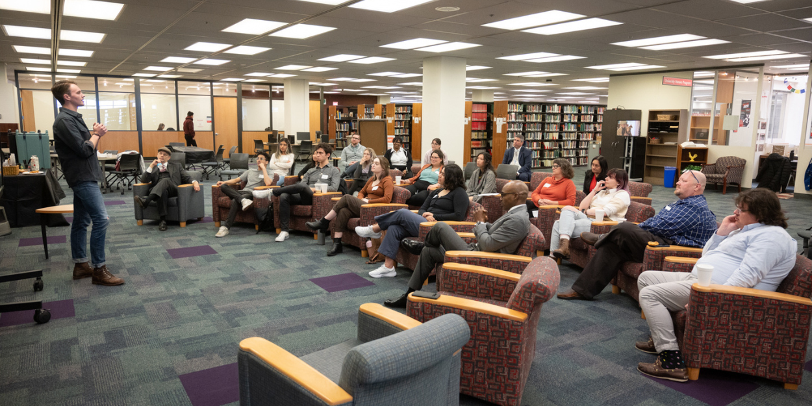
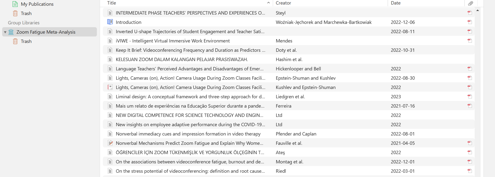
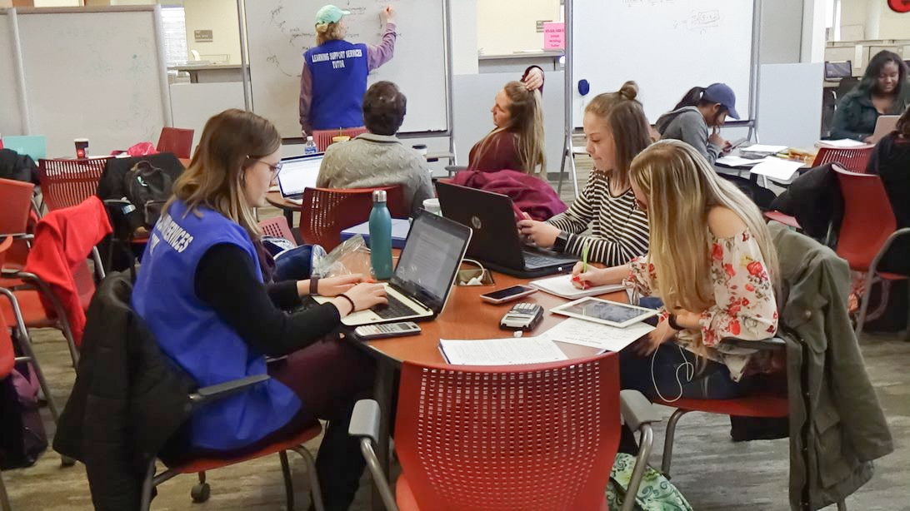
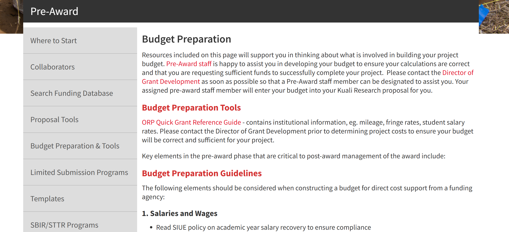

# The Many SIUE Resources

## Introduction to SIUE Resources

Southern Illinois University Edwardsville (SIUE) offers a comprehensive suite of academic and research resources designed to empower students and faculty in their pursuit of knowledge, innovation, and professional development. These resources are invaluable for navigating the complexities of university-level research, especially for new learners transitioning to advanced academic environments. From specialized research tools to collaborative programs, SIUE fosters an environment that supports creativity, critical thinking, and scholarly achievement.

### Why Engage with SIUE Resources? {.unnumbered}

Engaging with the resources at SIUE is not just about meeting academic requirements---it is about building a foundation for lifelong learning and professional success. Whether refining writing skills, managing complex data analyses, or conducting ethically sound research, these resources ensure students and faculty have the tools and support necessary to excel. By leveraging these opportunities, researchers gain not only technical proficiency but also the confidence to address complex challenges and contribute to their fields meaningfully.

### Highlights of SIUE's Academic Support Ecosystem {.unnumbered}

1.  **Lovejoy Library**: A state-of-the-art library system offering access to a vast collection of physical and digital resources, personalized research support, and advanced technological tools for data analysis and visualization.
2.  **SIUE Writing Center**: A dedicated space for developing academic writing skills through one-on-one tutoring, workshops, and resources tailored to student needs, including help with citations and academic formatting.
3.  **Institutional Review Board (IRB)**: Ensuring ethical and responsible research practices, the IRB provides oversight, guidance, and training for studies involving human participants.
4.  **Office of Research and Projects (ORP)**: A cornerstone for research funding, compliance, and project management, the ORP supports researchers at every stage, from proposal development to post-award administration.
5.  **Zotero and Citation Tools**: Streamlining citation management and academic integrity, these tools simplify the organization of sources and integration into research projects.
6.  **Information Technology Services (ITS)**: Offering cutting-edge computing resources, including high-performance computing systems, specialized software, and cyberinfrastructure, ITS supports advanced research and analysis.
7.  **Undergraduate Research and Creative Activities (URCA)**: Providing hands-on research opportunities, URCA connects students with faculty mentors, fostering skill development and professional growth.
8.  **IRIS Center**: A hub for interdisciplinary research and innovation, the IRIS Center facilitates collaboration across technology, humanities, and social sciences.

### Preparing for Success {.unnumbered}

The resources provided by SIUE reflect its commitment to supporting student and faculty success. By engaging early and often with these tools and services, individuals can enhance their academic and professional journeys. Whether exploring new methodologies, developing a groundbreaking thesis, or collaborating across disciplines, SIUE equips its community to thrive in a dynamic academic landscape.

## Lovejoy Library

The Lovejoy Library at Southern Illinois University Edwardsville (SIUE) is an essential resource for academic success, providing a wealth of tools, services, and materials designed to support research, learning, and creativity. Whether you are a new learner navigating your first research assignment or an experienced scholar delving into advanced topics, Lovejoy Library offers tailored resources to meet your needs.

{width="100%"}

### Comprehensive Research Resources {.unnumbered}

Lovejoy Library provides access to an extensive collection of resources, both physical and digital:

-   **Books and Journals**: A vast array of print and electronic volumes spanning diverse disciplines.
-   **Specialized Databases**: Resources such as JSTOR, ProQuest, and EBSCOhost provide access to peer-reviewed articles and other scholarly materials. These databases support keyword searches, author lookups, and advanced filters to streamline research.
-   **Multimedia and Government Documents**: Supplementary resources that enhance interdisciplinary studies.

Using the **online catalog**, students can search for books, articles, and other materials, place holds on physical resources, and access digital content. Filters for subject, date, or resource type simplify the search process.

### Personalized Support and Expert Guidance {.unnumbered}

The library's staff of skilled librarians provides personalized assistance to help students refine research topics, navigate databases, and develop effective strategies for sourcing credible information:

-   **One-on-One Consultations**: Schedule sessions with librarians for tailored research support.
-   **Ask-A-Librarian Service**: Get quick answers via chat, email, or phone.
-   **Workshops and Tutorials**: Learn about database navigation, citation management, and avoiding plagiarism through interactive sessions.

### Study and Collaboration Spaces {.unnumbered}

Lovejoy Library is designed to support a variety of study needs:

-   **Quiet Study Areas**: Individual workspaces free from distractions.
-   **Group Study Rooms**: Collaborative spaces equipped for team projects.
-   **Technology Access**: Computer labs with software like RStudio, Tableau, and Adobe Creative Suite, along with printers and scanners.

### Citation and Academic Integrity Tools {.unnumbered}

Proper citation is critical for maintaining academic integrity. Lovejoy Library provides:

-   **Citation Management Tools**: Support for Zotero and EndNote to organize references efficiently.
-   **Workshops on Academic Integrity**: Sessions addressing plagiarism and proper citation practices.

{width="100%"}

### Why Engage with Lovejoy Library? {.unnumbered}

Engaging with the resources and expertise at Lovejoy Library can significantly enhance your academic journey:

-   Gain access to credible sources.
-   Develop research and critical thinking skills.
-   Create a strong foundation for future academic and professional success.

By utilizing these resources, students can transform academic challenges into opportunities for growth and discovery.

## SIUE Writing Center

The Writing Center at Southern Illinois University Edwardsville (SIUE) is a cornerstone for developing strong academic writing skills. Offering personalized support and comprehensive resources, the Writing Center empowers students to excel in their writing projects while building confidence and independence as writers.

### Personalized Tutoring Sessions {.unnumbered}

The Writing Center provides **one-on-one tutoring sessions** to address specific writing challenges:

-   **Brainstorming Ideas**: Assistance with generating topics and developing thesis statements.
-   **Drafting and Organization**: Support for structuring arguments and creating cohesive narratives.
-   **Grammar and Style**: Guidance on sentence structure, clarity, and overall style.

{width="100%"}

Tutors work collaboratively with students to identify areas for improvement, offering feedback that fosters skill development rather than merely correcting errors.

### Navigating Academic Formatting and Citations {.unnumbered}

For research projects requiring specific style guidelines, the Writing Center offers expertise in:

-   **APA, MLA, and Chicago Style**: Assistance with proper formatting, citation practices, and bibliographies.
-   **Avoiding Plagiarism**: Guidance on integrating sources responsibly and maintaining academic integrity.

### Workshops and Online Resources {.unnumbered}

The Writing Center also hosts workshops and provides online tools to support self-directed learning:

-   **Workshops**: Topics include structuring research papers, integrating evidence, and developing revision strategies.
-   **Online Resources**: Handouts, video tutorials, and guides on writing fundamentals, accessible through the Writing Center's website.

### Appointment Options and Procedures {.unnumbered}

Students can schedule tutoring sessions in various formats:

1.  **In-Person Tutoring**: Traditional face-to-face sessions at the Writing Center.
2.  **Online Tutoring**: Real-time video sessions with a tutor, focusing on specific areas of concern.
3.  **e-Tutoring**: Submit your paper via email and receive asynchronous feedback with comments and suggestions.

To schedule a session:

-   Visit [siue.mywconline.com](https://siue.mywconline.com/).
-   Provide details about your assignment and areas of concern.
-   Choose your preferred tutoring format.

**Session Guidelines**:

-   Sessions are limited to 30 minutes.
-   Students may schedule one session per day and up to two sessions per week.

### Empowering Confident Writers {.unnumbered}

The Writing Center emphasizes teaching students how to identify and address their own writing challenges, fostering long-term growth. By engaging with its resources and services, students not only improve individual assignments but also develop skills that will serve them throughout their academic and professional careers.

## Institutional Review Board (IRB)

The Institutional Review Board (IRB) at Southern Illinois University Edwardsville (SIUE) plays an essential role in ensuring that research involving human participants is conducted ethically and in compliance with federal regulations and institutional policies. For students and new researchers, navigating the IRB process may initially appear complex, but it is an invaluable component of conducting responsible and credible research. Understanding the IRB's purpose, processes, and requirements will not only help you meet ethical and regulatory standards but also enhance the quality and integrity of your work.

### The Role and Principles of the IRB {.unnumbered}

The IRB is tasked with reviewing research proposals to ensure that studies involving human participants adhere to ethical principles and minimize risks. This oversight is grounded in the principles established by the Belmont Report:

1.  **Respect for Persons**: Researchers must uphold participants' autonomy and ensure informed consent. This includes providing clear, accessible information about the study's purpose, procedures, and potential risks and benefits.
2.  **Beneficence**: Studies must be designed to maximize benefits and minimize harm to participants, ensuring their well-being is prioritized throughout the research process.
3.  **Justice**: Researchers must ensure the equitable selection of participants, avoiding exploitation of vulnerable groups and ensuring fair distribution of risks and benefits.

### Navigating the IRB Process {.unnumbered}

Before initiating any study involving human participants, researchers must submit their project for IRB review. The process involves several key steps:

#### Step 1: Screening and Submission {.unnumbered}

Determine whether your project qualifies as human subjects research (HSR) and requires IRB approval. SIUE provides a screening tool within the Kuali electronic protocol system to help researchers make this determination. Common activities requiring IRB review include surveys, interviews, focus groups, and experiments involving human data. Even if your study may qualify for exempt status (e.g., anonymous surveys), the IRB must still review and approve the protocol.

-   **Review Timelines**:
    -   Exempt Review: 1--3 weeks
    -   Expedited Review: 3--6 weeks
    -   Full Board Review: 4--8 weeks or longer (reviewed during monthly meetings)

For full board reviews, submit your protocol at least two weeks before the second Wednesday of the month to meet the monthly meeting deadline.

#### Step 2: CITI Certification {.unnumbered}

All researchers involved in the study must complete the Collaborative Institutional Training Initiative (CITI) certification before IRB approval. This training ensures researchers understand ethical standards and best practices for working with human participants. Courses include:

-   **IRB Social Behavioral Student**
-   **IRB Social Behavioral Faculty**
-   **Biomedical Researcher**
-   **IRB Member**

{width="100%"}

CITI training provides critical insights into informed consent, confidentiality, and managing participant risks, equipping you to design ethically sound research.

#### Step 3: Preparing and Submitting Your Protocol {.unnumbered}

Log into the [Kuali Online IRB Protocol System](https://siue.kuali.co/protocols) to create and submit your protocol. Your submission should include:

-   A detailed study description outlining its purpose, methodology, and expected outcomes
-   Informed consent forms with clear, participant-friendly language
-   Recruitment materials, surveys, interview guides, or other relevant documents

{width="100%"}

For guidance, use the available [online tutorial](https://www.siue.edu/its/training/KRProtocols/story_html5.html) and [IRB Protocol Guide](https://www.siue.edu/compliance/human-subjects/pdf/IRBProtocolGuidance.pdf). Faculty may direct students to the [SandBox Practice Site](https://siue-sbx.kuali.co/protocols) to familiarize themselves with the system before submitting a live protocol.

#### Step 4: Insurance for Student-Initiated Research {.unnumbered}

If your study is not part of a course or degree requirement, you may need to obtain research insurance. The SIU Risk Management Office provides details on [required coverage](http://siusystem.edu/risk-management/insurancereq.shtml). Proof of insurance must be submitted before protocol approval.

#### Step 5: Post-Approval Responsibilities {.unnumbered}

Once your protocol is approved, it is essential to adhere to the approved procedures and promptly report any changes, adverse events, or project completion. Use the Kuali system to:

1.  **Amend Protocols**: Submit changes to your study and await IRB approval before implementing them.
2.  **Submit Reports**: Provide annual progress reports or completion reports as instructed by the IRB.

#### Step 6: Reporting Adverse Events {.unnumbered}

Any unanticipated problems or adverse events must be reported to the IRB immediately by contacting [researchcompliance\@siue.edu](mailto:Researchcompliance@siue.edu) or calling 618-650-3010. Timely reporting ensures participant safety and compliance with federal regulations.

### Levels of IRB Review {.unnumbered}

The IRB provides three levels of review based on the risk level and study complexity:

1.  **Exempt Review**: For minimal-risk studies, such as anonymous surveys. These receive a quicker review process.
2.  **Expedited Review**: For research involving minimal risk but requiring more thorough review, such as non-anonymous interviews.
3.  **Full Board Review**: For studies involving greater risks, such as sensitive topics or vulnerable populations. These reviews are conducted during monthly meetings and require detailed scrutiny.

### Why Engage with the IRB? {.unnumbered}

While the IRB process may seem daunting, it provides several benefits:

-   **Strengthens Research Design**: IRB feedback helps refine your methodology, ensuring ethical rigor and clear protocols.
-   **Builds Ethical Awareness**: Engaging with the IRB process prepares you to conduct responsible research throughout your career.
-   **Fosters Credibility**: Ethical compliance enhances the integrity and impact of your findings, fostering trust within the academic community and beyond.

### Resources and Support {.unnumbered}

SIUE's IRB offers extensive resources to guide researchers:

-   **Workshops and Tutorials**: Gain hands-on training to navigate the IRB process confidently.
-   **Templates and Tools**: Access standardized forms for informed consent, recruitment, and study design.
-   **Consultations**: Schedule one-on-one meetings with IRB staff to address specific questions or concerns.

By understanding and engaging with the IRB process, you ensure that your research meets the highest ethical standards, contributing to knowledge advancement while safeguarding the well-being of participants. Ethical research practices are not just a requirement---they are a commitment to integrity and respect for the individuals and communities involved in your studies.

## Office of Research and Projects (ORP)

The Office of Research and Projects (ORP) at Southern Illinois University Edwardsville (SIUE) is a vital resource for fostering and supporting research, scholarship, and creative activities across the university. For students, faculty, and staff, the ORP serves as a comprehensive hub for navigating the complexities of research funding, compliance, and project management. By engaging with the ORP, researchers gain access to a wide range of resources designed to enhance their work's quality, impact, and ethical rigor.

### Research Funding and Proposal Development {.unnumbered}

A primary role of the ORP is to assist researchers in securing funding for their projects. Whether you are applying for internal grants at SIUE or seeking external funding from organizations like the National Science Foundation (NSF), the ORP provides personalized support to help you identify opportunities that align with your research interests. Services include:

-   **Funding Opportunity Identification**: Access tools and databases to find grants that match your project's goals.
-   **Proposal Development Support**: Participate in workshops or schedule one-on-one consultations to craft competitive proposals, write persuasive narratives, and align your objectives with the priorities of funding agencies.
-   **Internal Funding Programs**: Apply for internal awards that support both faculty and student research initiatives.

These services are particularly valuable for new researchers, offering step-by-step guidance through the grant application process and equipping them with skills that extend beyond academia.

### Ensuring Compliance and Ethical Research {.unnumbered}

The ORP plays a central role in ensuring that all research activities adhere to institutional policies, federal regulations, and ethical guidelines. Key areas of compliance include:

-   **Human Subjects Research**: Collaborating with the Institutional Review Board (IRB) to review and approve projects involving surveys, interviews, or other interactions with human participants.
-   **Animal Research**: Providing oversight and guidance for studies involving animals to ensure adherence to ethical standards.
-   **Hazardous Materials and Specialized Facilities**: Offering support to manage projects requiring the use of hazardous materials, specialized labs, or sensitive data.

{width="100%"}

The ORP's **Compliance Section** ensures that research is conducted with integrity, balancing the interests of the university, researchers, participants, and funding agencies. For more details, consult the [Compliance Website](https://www.siue.edu/compliance/).

### Project Management and Post-Award Support {.unnumbered}

Securing funding is only the first step in a successful research project. Managing the financial, logistical, and reporting aspects of a grant can be challenging, particularly for those new to research. The ORP offers:

-   **Pre-Award Support**: Assistance with budget development, proposal submission, and navigating sponsor guidelines through tools like **Kuali Research**.
-   **Post-Award Management**: Guidance on tracking expenditures, fulfilling reporting requirements, and ensuring compliance with sponsor mandates.

By simplifying administrative tasks, the ORP allows researchers to focus on the intellectual and creative aspects of their work, ensuring projects remain on track and meet all obligations.

### Building a Collaborative Research Environment {.unnumbered}

The ORP actively fosters interdisciplinary collaboration among researchers at SIUE, creating opportunities to share ideas and build partnerships. Through networking events, research symposia, and seminars, the ORP provides a platform for researchers across disciplines to connect and tackle complex challenges together. For students, these events offer valuable exposure to innovative methodologies, diverse perspectives, and potential collaborators.

### Student-Focused Resources {.unnumbered}

Recognizing the importance of nurturing new researchers, the ORP offers tailored resources for students:

-   **Workshops and Training**: Learn critical skills such as proposal writing, research ethics, and project management in hands-on sessions.
-   **Online Resources**: Access templates, examples of successful proposals, and guides for navigating funding databases through the ORP website.
-   **Practice Platforms**: Use tools like the **Kuali Build SandBox Site** to simulate protocol creation and learn the system before submitting live applications.

By providing these resources, the ORP demystifies the research process and builds students' confidence, enabling them to engage in meaningful scholarship.

### Tools and Resources Available Through the ORP {.unnumbered}

The ORP provides access to a range of tools designed to streamline research administration:

-   **Kuali Research**: A comprehensive platform for submitting disclosures, managing sub-awards, and tracking progress.
-   **Kuali Build**: An electronic system for routing and submitting internal funding applications and forms.
-   **ORP Quick Reference Guide**: A resource for developing budgets, creating cover sheets, and navigating application requirements.

### The Role of the ORP in Academic and Professional Growth {.unnumbered}

The ORP is more than an administrative office---it is a partner in your academic and professional journey. By engaging with its services early, students and faculty can:

-   **Enhance Research Quality**: Leverage expert guidance to refine proposals and methodologies.
-   **Ensure Ethical Integrity**: Meet the highest standards for compliance and ethical conduct in research.
-   **Expand Opportunities**: Build connections across disciplines, access funding, and develop critical research skills.

### Balancing Institutional and Researcher Objectives {.unnumbered}

The ORP carefully balances the university's mission, the intellectual pursuits of researchers, and the objectives of funding agencies. This approach ensures that research activities are aligned with SIUE's broader goals while empowering individual scholars to pursue innovative and impactful work.

## Zotero - Citation Management Made Simple

**Zotero** is an indispensable tool for managing citations and organizing research at Southern Illinois University Edwardsville (SIUE). This free, user-friendly software simplifies the process of collecting, organizing, and citing sources, making it ideal for students and researchers alike.

### Key Features of Zotero {.unnumbered}

-   **Citation Collection**: Save references from books, articles, and websites with one click.
-   **Integration with Word Processors**: Automatically generate in-text citations and bibliographies in APA, MLA, Chicago, and other styles directly in Microsoft Word, Google Docs, or LibreOffice.
-   **Organization**: Create folders and collections for different projects to keep research materials organized.
-   **Attachments**: Store PDFs, images, and notes alongside your citations.

### Installation and Usage {.unnumbered}

-   **Zotero Desktop**: Download the latest version from [Zotero.org](https://www.zotero.org/) and install the Zotero Connector plugin for your browser.
-   **Zotero Online**: Access your library anytime by logging into Zotero's website.
-   **Word Processor Plugins**: Use Zotero's plugins to "cite while you write" in Word and other platforms.

### Tutorials and Support {.unnumbered}

-   SIUE offers workshops and guides to help students maximize Zotero's capabilities. Check out the official [Zotero Quick Start Guide](https://www.zotero.org/support/quick_start_guide) for further details.

**Why Use Zotero?** Zotero streamlines the often-overwhelming task of managing citations, ensuring academic accuracy and saving time, especially for complex research projects.

## Information Technology Services (ITS) - Advanced Computing Resources

The **Office of Information Technology Services (ITS)** at SIUE supports advanced research through cutting-edge computing infrastructure and specialized software.

### Key Resources and Tools {.unnumbered}

-   **High-Performance Computing (HPC)**: Access the Slurm Compute Cluster for computational research with both CPU and GPU nodes, optimized for data-intensive projects.
-   **Cyberinfrastructure**:
    -   10Gb/s connection to Internet2 and the Metropolitan Research and Education Network (MREN).
    -   High-performance storage clusters for data-intensive research.
    -   OpenStack cluster for virtualized computing needs.
-   **Research Software**: Utilize tools such as RStudio, Python, Tableau, and Adobe Creative Suite for statistical modeling, data visualization, and content creation.

### Support and Training {.unnumbered}

-   **Workshops**: ITS offers training sessions for tools like R, Python, and advanced data visualization software.
-   **Consultation Services**: Tailored guidance for integrating computing resources into research projects.

**Why Leverage ITS?** Whether you're modeling complex systems, analyzing large datasets, or visualizing trends, ITS ensures you have the tools and expertise to succeed.

## Undergraduate Research and Creative Activities (URCA)

The **Undergraduate Research and Creative Activities (URCA)** program provides students at SIUE with opportunities to engage in hands-on research and creative projects under faculty mentorship.

### Types of URCA Opportunities {.unnumbered}

1.  **URCA Assistants**:
    -   Work with faculty on research or creative projects for 6--9 hours per week.
    -   Eligible for a \$750 semester award or academic credit.
2.  **URCA Associates**:
    -   Conduct independent research with faculty supervision.
    -   Present findings at conferences or exhibitions.

### Benefits of Participation {.unnumbered}

-   Gain practical experience in research and creative processes.
-   Build professional relationships with mentors and peers.
-   Strengthen critical thinking, communication, and data analysis skills.
-   Enhance your résumé or graduate school applications.

**How to Get Involved**: Visit the [URCA Program Website](https://www.siue.edu/urca/) to explore opportunities and apply.

## Interdisciplinary Research and Informatics Scholarship (IRIS)

The **IRIS Center** at SIUE fosters innovative, interdisciplinary research at the intersection of technology, humanities, and social sciences.

### Mission and Goals {.unnumbered}

-   Support digital scholarship through advanced tools and methodologies.
-   Facilitate collaboration among faculty and students.
-   Promote curricular innovation integrating digital applications.
-   Advance community-oriented digital projects.

### Key Resources {.unnumbered}

-   **Facilities and Tools**: Access to cutting-edge technology for digital humanities and social sciences research.
-   **Research Consultations**: One-on-one guidance on tool selection, project sustainability, and audience engagement.
-   **The SIM Lab**: Focus on projects related to virtual reality, social media analysis, and human-computer interaction.

**Why Engage with IRIS?** IRIS provides a dynamic environment for exploring emerging trends and technologies, preparing students for future academic and professional challenges.
