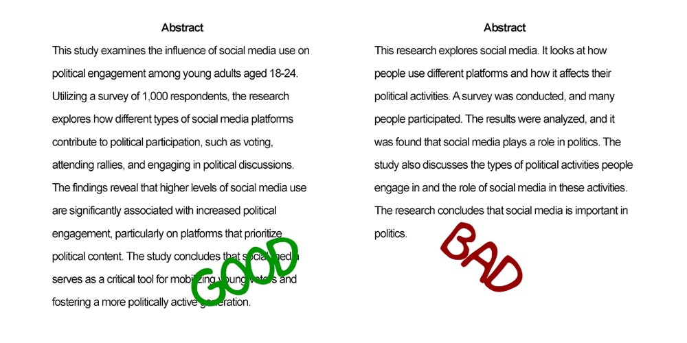
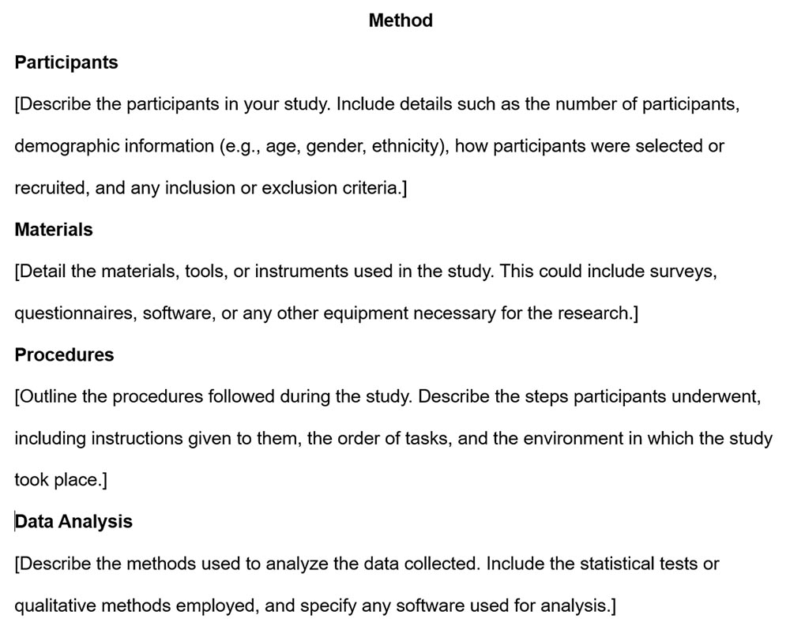
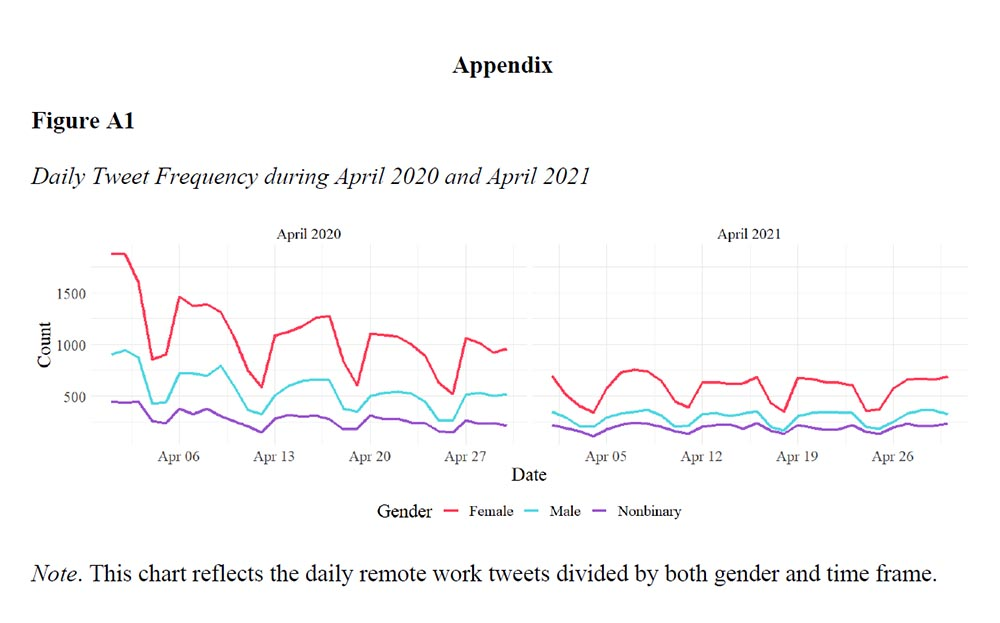
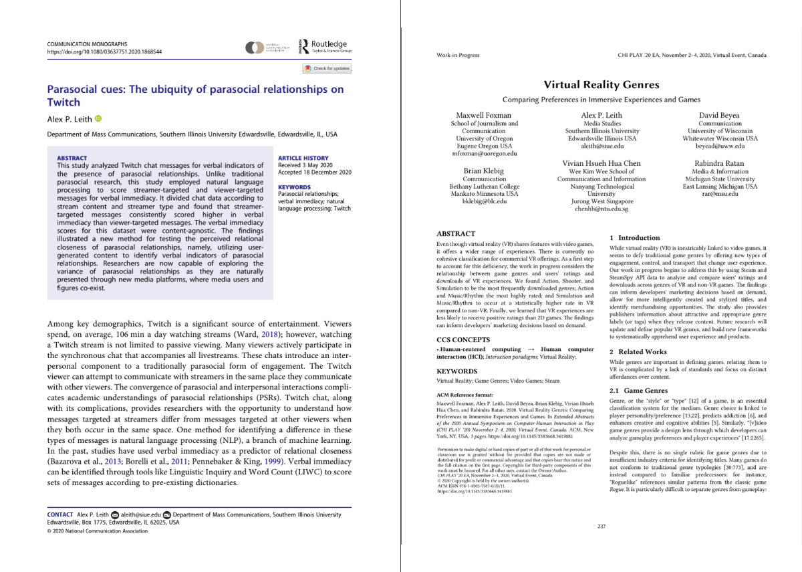
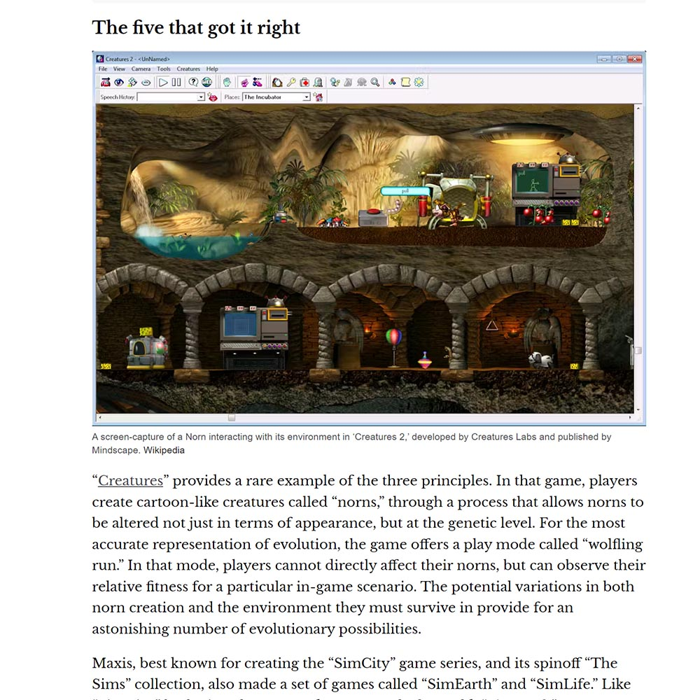
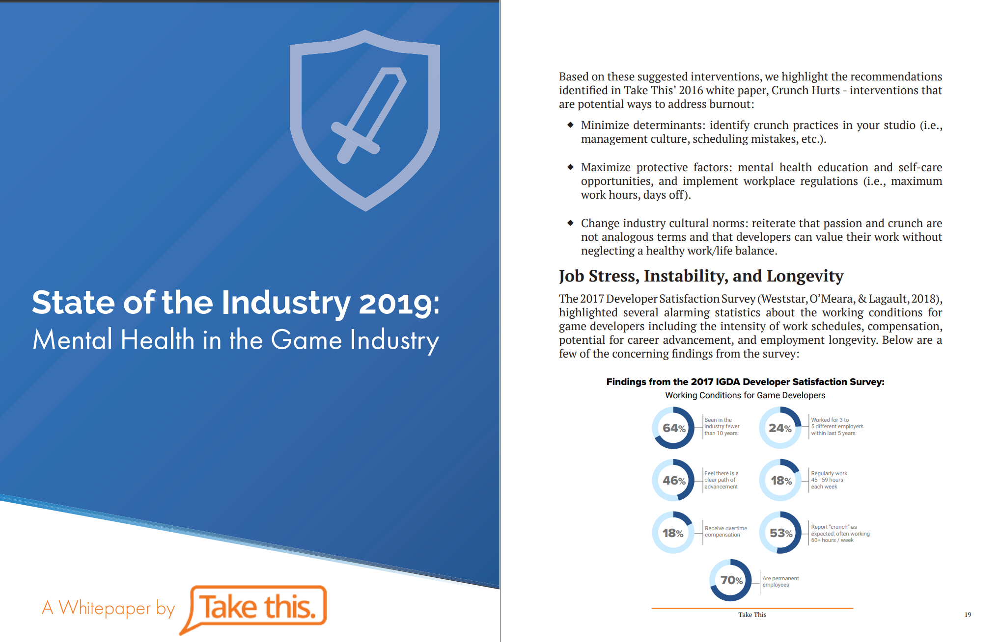

# Introduction to Research Papers

## Structuring a Research Paper

Writing a research report requires careful organization to effectively communicate the purpose, methods, findings, and conclusions of a study. Each section of a research paper serves a distinct function, guiding the reader through the research process in a logical and structured manner. Understanding the role of each section and how to write them effectively ensures that the paper is clear, coherent, and impactful.

### Title {.unnumbered}

The title of a research paper is the first point of engagement for the reader. It should be **clear, concise, and informative**, giving a snapshot of the study's focus. A strong title includes key variables or the primary subject of study without being overly lengthy—typically no more than **12 words**. It should be formatted correctly, **bold, centered, and double-spaced** on the title page. Capitalization rules apply: **only the first word and proper nouns are capitalized**, even if a semicolon is used in the title. A well-crafted title ensures the reader understands what to expect, improving discoverability in academic databases.

### Abstract {.unnumbered}

The **abstract** is a concise summary of the research paper, typically **150 to 250 words** long, providing an overview of the study. It is written in **past tense** and should not contain citations. The abstract must succinctly cover the **research purpose, methods, key findings, and conclusions**. Since the abstract is often the first—and sometimes only—part of the paper that many readers engage with, clarity and brevity are essential. A well-written abstract enables readers to quickly assess the relevance of the study to their interests and research.

{width="100%"}

### Introduction {.unnumbered}

The **introduction** provides the foundation for the research paper. It presents the research problem, its significance, and the research question or hypothesis. This section should accomplish the following:

- **Introduce the topic** and explain its relevance.
- **Provide background information** and connect it to existing research.
- **Clearly state the research question or hypothesis.**
- **Outline the structure** of the paper to help readers navigate the content.

A strong introduction engages the reader by linking the study to real-world problems or theoretical debates, setting the stage for the rest of the report.

{width="100%"}

### Literature Review {.unnumbered}

The **literature review** contextualizes the research within the existing body of knowledge. Rather than simply summarizing past studies, this section should **synthesize and critically analyze** prior research, highlighting gaps, contradictions, and areas for further investigation. Key purposes of the literature review include:

- Demonstrating the researcher’s knowledge of the field.
- Justifying why the study is needed by identifying gaps in the literature.
- Establishing a theoretical framework for the study.
- Providing a basis for comparing the study's findings with previous research.

The literature review should be organized thematically or methodologically, making it easier for readers to follow the connections between different studies and the current research.

### Methods {.unnumbered}

The **methods** section details how the study was conducted, allowing other researchers to replicate the research or assess its validity. It typically includes:

1. **Participants or Data Sources** – Describing who or what was studied and how subjects were selected.
2. **Materials or Instruments** – Identifying tools, surveys, software, or measurement instruments used.
3. **Procedures** – Outlining the steps taken to collect data.
4. **Data Analysis** – Explaining how the data was processed and analyzed.

The methods section must be clear, precise, and thorough. It is written in the **past tense** since it describes completed actions.

{width="100%"}

### Results {.unnumbered}

The **results** section presents the findings of the study in an objective manner, free from interpretation. It includes:

- **Descriptive statistics** (e.g., means, standard deviations, frequencies).
- **Inferential statistics** (e.g., t-tests, ANOVA, regression results).
- **Tables, graphs, and figures** to enhance clarity.

Each result should be clearly labeled and presented logically, often following the structure outlined in the methods section. The results should not include explanations or implications—those belong in the discussion section.

### Discussion {.unnumbered}

The **discussion** section interprets the results and relates them back to the research question, hypothesis, and existing literature. This section should:

1. **Summarize key findings** without simply repeating the results section.
2. **Compare findings to prior research** and theoretical frameworks.
3. **Discuss unexpected results** and possible explanations.
4. **Acknowledge limitations** of the study and their implications.
5. **Suggest directions for future research.**

The discussion provides the critical interpretation of findings, ensuring that the study contributes to ongoing academic conversations.

### Conclusion {.unnumbered}

The **conclusion** provides a concise summary of the key findings, reinforcing their significance. It should:

- **Restate the research question and summarize the main findings.**
- **Explain the broader implications of the study.**
- **Highlight recommendations for practice, policy, or future research.**

A strong conclusion ties everything together without introducing new arguments or data. It leaves the reader with a clear understanding of the study's contribution.

### References {.unnumbered}

The **references** section provides a comprehensive list of all sources cited in the paper, formatted according to the appropriate academic style (e.g., APA, MLA, Chicago). Proper referencing is essential for:

- **Giving credit to original authors.**
- **Ensuring academic integrity.**
- **Allowing readers to locate cited sources.**

Students should use reference management tools like **Zotero, EndNote, or Mendeley** to maintain accurate citations.

{width="100%"}

### Appendix {.unnumbered}

An **appendix** contains supplementary materials that are too detailed or extensive for the main body of the paper. These can include:

- Survey instruments.
- Large tables of data.
- Detailed methodological descriptions.
- Additional figures.

The appendix should be referenced in the main text when necessary.

{width="100%"}

### Relationship Between Sections {.unnumbered}

Each section of a research paper serves a **distinct but interconnected role**, contributing to the overall coherence of the study:

1. **The Title and Abstract** capture attention and provide an overview.
2. **The Introduction and Literature Review** establish the context and research justification.
3. **The Methods and Results** document how the study was conducted and what was found.
4. **The Discussion and Conclusion** interpret findings and explain their significance.
5. **References and Appendices** provide support materials and additional resources.

By following this structure, students can ensure their research papers are logically organized, academically rigorous, and effectively communicate their findings.

### Examples of Formal Reports {.unnumbered}

#### Academic Examples {.unnumbered}

There are many different ways to report research in academia. Some of the most common methods include:

**Research papers**: Research papers are the most common way to report research in academia. They are typically published in academic journals and are written in a formal style.

**Conference papers**: Conference papers are presented at academic conferences. They are typically shorter than research papers and are written in a more informal style.

{width="100%"}

**Theses and dissertations**: Theses and dissertations are written by graduate students to complete their degree requirements. They are typically longer and more comprehensive than research papers.

**Books**: Books are another way to report research. They are typically written by experts in a particular field and can be a good way to communicate research to a wider audience.

**Reports**: Reports are written for a specific audience, such as a government agency or a business. They are typically shorter than research papers and focus on a specific topic.

**Presentations**: Presentations are a way to share research with a live audience. They can be given at conferences, workshops, or other events.

{width="100%"}

**Blogs and social media**: Blogs and social media can be used to share research with a wider audience. They are a good way to communicate research in a more informal way.

The best way to report research depends on the specific research project and the intended audience. However, all of these methods can be effective ways to communicate research findings and to contribute to the academic community.

{width="100%"}

#### Industry Examples {.unnumbered}

There are many different ways to report research in industry. Some of the most common methods include:

**White papers**: White papers are a type of report that is commonly used in industry to present research findings to a specific audience. They are typically written in a clear and concise style and focus on a specific topic.

{width="100%"}

**Executive summaries**: Executive summaries are a brief overview of a white paper or other research report. They are typically written for senior executives and other decision-makers.

**Presentations**: Presentations are a way to share research findings with a live audience. They can be given at company meetings, conferences, or other events.

**Blogs and social media**: Blogs and social media can be used to share research findings with a wider audience. They are a good way to communicate research in a more informal way.

**Press releases**: Press releases are a way to share research findings with the media. They are typically written in a clear and concise style and focus on the key findings of the research.

**Technical reports**: Technical reports are a detailed document that describes the research methods and findings. They are typically written for a technical audience.

The best way to report research in industry depends on the specific research project and the intended audience. However, all of these methods can be effective ways to communicate research findings and to contribute to the industry community.

## Finding Research Papers

Finding research papers is an essential skill for students and researchers alike. Research papers are the backbone of academic work, providing the evidence, insights, and foundations necessary for developing new theories, testing hypotheses, and building knowledge. Whether you're writing a paper, preparing a presentation, or simply expanding your understanding of a topic, knowing how to locate and access research papers efficiently is crucial. Below are some effective strategies to help you find the research papers you need.

### Check Your University Library {.unnumbered}

Your university library is one of the most valuable resources for finding research papers. University libraries provide access to a vast array of academic materials, including books, journals, and databases that are often not available for free online. Here's how to make the most of your university library's resources:

[**Talk to a Librarian**](https://www.siue.edu/lovejoy-library/ask-a-librarian/)**.** Librarians are highly trained in information retrieval and can assist you in finding the most relevant and high-quality research papers for your topic. They can guide you to the right databases, help you refine your search strategies, and even suggest keywords or subject headings you might not have considered. Many libraries also offer personalized research consultations where you can get in-depth assistance on your specific research needs.

[**Use the Library's Online Catalog**](https://i-share-sie.primo.exlibrisgroup.com/discovery/search?vid=01CARLI_SIE:CARLI_SIE&lang=en)**.** The online catalog is a powerful tool that allows you to search the entire collection of your university library, including books, journals, e-books, and other materials. You can narrow down your results by using specific search terms or filters to find the most relevant research papers. Most catalogs also allow you to see whether the materials are available physically in the library or online.

[**Access the Library's Databases**](https://libguides.siue.edu/az.php)**.** University libraries subscribe to many academic databases that provide access to thousands of scholarly journals, articles, and other resources. These databases are often organized by subject, making finding research papers in your field of study easier. Popular databases include JSTOR, ProQuest, and EBSCOhost, among others. Databases can usually be searched by keyword, author, or subject, and many offer advanced search options that allow you to combine terms and apply filters to get the best results.

### Use a specialized search engine. {.unnumbered}

Specialized search engines are designed to search for specific types of information, such as research articles. Here are some tips on how to use a specialized search engine to find research articles:

#### Where to Search {.unnumbered}

When searching for research articles, knowing where to search is just as important as how you search. Specialized search engines are designed specifically for academic and scholarly materials, making them ideal tools for finding high-quality research papers. Unlike general search engines like Google, these specialized tools index scholarly content such as journal articles, conference papers, and theses. Below are some key specialized search engines and tips on how to choose the right one for your research needs.

Selecting the appropriate search engine depends on your research topic. If you're studying medicine or biology, PubMed should be your first choice. For engineering and technology, IEEE Xplore and ACM Digital Library are more suitable. If your research spans multiple disciplines, starting with Google Scholar, Web of Science, or Scopus may yield the broadest results.

**1. Google Scholar**

Google Scholar is one of the most widely used academic search engines. It provides access to a broad range of scholarly articles, theses, books, conference papers, and patents across various disciplines. It's a good starting point for most research topics due to its extensive coverage.

[{width="100%"}](https://scholar.google.com/)

**2. PubMed**

PubMed is the go-to search engine for research in the biomedical and life sciences. It offers a comprehensive collection of articles from journals in medicine, biology, and health-related fields. If your research is in these areas, PubMed is an indispensable resource.

[{width="100%"}](https://pubmed.ncbi.nlm.nih.gov/)

**3. Web of Science**

Web of Science is a powerful tool that covers a wide array of disciplines, including the sciences, social sciences, arts, and humanities. It is particularly useful for citation tracking, allowing you to see how often an article has been cited by others, which can help you gauge its impact and relevance.

[{width="100%"}](https://go.openathens.net/redirector/siue.edu?url=https%3A%2F%2Fwebofknowledge.com%2FWOS)

**4. Scopus**

Scopus is another multidisciplinary database, with an extensive collection of articles in the sciences, technology, medicine, social sciences, and more. Scopus also provides citation analysis, making it useful for understanding the influence of a particular study within its field.

[{width="100%"}](https://www.scopus.com/home.uri)

**5. IEEE Xplore**

IEEE Xplore is the premier search engine for research in electrical engineering, computer science, and electronics. It indexes a vast number of conference papers, journal articles, and standards published by the IEEE.

[{width="100%"}](https://ieeexplore.ieee.org/Xplore/home.jsp)

**6. ACM Digital Library**

The ACM Digital Library is essential for computer science research, offering a wide range of articles, conference proceedings, and other publications by the Association for Computing Machinery. It is particularly valuable for topics in software engineering, computer systems, and human-computer interaction.

[{width="100%"}](https://dl.acm.org/)

#### How to Search {.unnumbered}

Once you've chosen where to search, understanding how to effectively use these tools is crucial for finding the most relevant and high-quality research articles. Below are strategies to help you optimize your search process.

**1. Use Keywords Effectively**

Keywords are the foundation of any search. Start by identifying the main concepts of your research topic. For example, if you're researching the effects of social media on mental health, your main keywords might be "social media," "mental health," and "impact." Input these keywords into your chosen search engine to begin your search.

**2. Utilize Advanced Search Features**

Most specialized search engines offer advanced search options that allow you to refine your search. You can often specify criteria such as:

-   **Publication Date:** Limit your results to recent publications to ensure the information is up-to-date.
-   **Language:** If you're only interested in articles written in a specific language, you can filter results accordingly.
-   **Document Type:** Narrow down your search to only include journal articles, reviews, conference papers, etc.

For instance, in Google Scholar, you can access these options by clicking on "Advanced Search," which allows you to combine keywords with Boolean operators, search within specific journals, or exclude certain terms from your results.

**3. Use Quotation Marks for Exact Phrases**

When searching for specific phrases, using quotation marks can help ensure that the search engine looks for the words together in the exact order you've specified. For example, searching for "impact of social media on mental health" will return results where this phrase appears as is, rather than finding articles where these words appear separately.

**4. Apply Boolean Operators**

Boolean operators (AND, OR, NOT) are powerful tools for refining your search:

-   **AND:** Use AND to narrow your search. For example, "social media AND mental health" will return articles that contain both terms.
-   **OR:** Use OR to broaden your search by including synonyms or related terms. For example, "social media OR social networks" will return articles that include either term.
-   **NOT:** Use NOT to exclude unwanted terms. For example, "social media NOT Facebook" will exclude articles that specifically focus on Facebook.

{width="100%"}

**5. Read and Evaluate Search Results Carefully**

After conducting your search, take the time to review the results carefully. Pay attention to the title, abstract, and keywords of each article to determine its relevance to your research. Ensure that the articles are published in reputable journals, have undergone peer review, and are authored by credible experts in the field.

**6. Use Filters to Narrow Down Results**

Many specialized search engines provide filters that allow you to narrow down results by various criteria, such as year of publication, subject area, or type of document. For instance, if you are looking for the most recent studies on a topic, you can filter your search results to only include articles published in the last five years.

**7. Refer to Help Documentation**

If you're unfamiliar with a particular search engine, refer to its help documentation. These guides often include tips on using advanced search features, understanding search results, and optimizing your search queries. For example, Google Scholar's help page provides explanations on how to refine searches, save citations, and set up alerts for new research.

By combining the right search engine with effective search strategies, you can efficiently find the research articles you need for your academic work.

### Using Social Media to Find Research Articles {.unnumbered}

Social media has become a powerful tool for academics and researchers, providing a platform to share, discover, and discuss research articles. By leveraging the features of various social media platforms, you can stay informed about the latest developments in your field, find relevant research articles, and connect with other scholars. Below are some effective strategies for using social media to find research articles.

#### 1. Follow Researchers and Research Institutions {.unnumbered}

One of the most direct ways to stay updated with the latest research is by following individual researchers, academic institutions, and research organizations on social media. Many scholars use platforms like Twitter, LinkedIn, and ResearchGate to share their latest publications, conference presentations, and ongoing projects. By following these accounts, you can receive updates on new research articles as soon as they are published. Additionally, institutions often share open access articles, preprints, and links to publications that might be behind paywalls elsewhere, providing valuable resources for your own research.

-   **Tip:** When following researchers, consider looking at their followers and who they follow as well. This can help you find other relevant scholars and institutions in your area of interest.

#### 2. Use Relevant Hashtags {.unnumbered}

Hashtags on social media platforms like Twitter and Instagram serve as powerful tools for categorizing content and making it discoverable to a broader audience. Researchers and institutions often use specific hashtags related to their field, research topic, or academic events. By searching for or following these hashtags, you can easily find posts related to recent research articles, discussions on emerging trends, and links to relevant studies.

-   **Example:** Searching for hashtags such as #OpenAccess, #ScienceTwitter, #AcademicChatter, or discipline-specific tags like #PsychResearch or #ClimateScience can lead you to valuable research articles and academic discussions.

#### 3. Join Research Groups and Communities {.unnumbered}

Social media platforms host numerous groups and communities dedicated to specific research fields or interdisciplinary topics. These groups, which can be found on platforms like Facebook, LinkedIn, and Reddit, are spaces where researchers share their work, seek advice, and discuss recent findings. Joining these groups allows you to engage with peers, discover articles that might not be widely publicized, and gain insights from ongoing academic discussions.

-   **Tip:** When joining a group, take the time to introduce yourself and share your research interests. Active participation can lead to more meaningful connections and opportunities to find relevant research articles.

#### 4. Attend Online Conferences and Workshops {.unnumbered}

The shift to virtual events has made it easier than ever to attend academic conferences and workshops from anywhere in the world. These events are often live-streamed on social media platforms or have dedicated hashtags for participants to follow along and discuss. Attending these online events allows you to access presentations, papers, and discussions that are directly relevant to your research. Additionally, many conferences post recordings of sessions or provide access to conference papers after the event, giving you further opportunities to explore new research.

-   **Tip:** After attending a session, engage with the speakers and attendees on social media by sharing your thoughts or asking questions. This can help you build a network of contacts who may share additional resources or research articles.

#### Specific Social Media Platforms to Use {.unnumbered}

**Twitter:** Twitter is an excellent platform for real-time research updates, especially by following researchers and journals and using hashtags. Many academic communities thrive on Twitter, making it a rich resource for finding the latest studies.

**LinkedIn:** LinkedIn is ideal for connecting with professionals and academics in your field. Researchers often share their publications and discuss their implications on LinkedIn, making it a valuable platform for professional networking and discovering research articles.

**ResearchGate:** ResearchGate is a dedicated social networking site for researchers. It allows you to follow researchers, access their publications, request full-text articles, and engage in discussions. It's particularly useful for finding peer-reviewed research and collaborating with other scholars.

**Evaluating Sources on Social Media**

While social media is a powerful tool for discovering research articles, it is crucial to critically evaluate the sources you find. Not all articles shared on social media are of high quality or come from reputable journals. Always consider the credibility of the author, the publication venue, and the methodology of the research before incorporating it into your own work. If in doubt, consult a librarian or an academic advisor for further guidance.

### Contacting Experts in Your Field {.unnumbered}

In addition to using social media, directly contacting experts in your field can be an invaluable way to find research articles and gain deeper insights into your study area. Experts can provide recommendations for key papers, suggest emerging research areas, and even share unpublished work that may not yet be available in databases.

#### 1. Talk to Your Professors or Advisors {.unnumbered}

Your professors and academic advisors are often the best starting point when seeking expert guidance. They have deep knowledge of the field, are familiar with the latest research, and can point you toward seminal papers or recommend specific articles that are highly relevant to your research. Moreover, they may have access to articles or resources that are not available to students, which can further enrich your research.

-   **Tip:** When approaching your professors, be specific about your research topic and what you hope to learn. This will help them provide more targeted recommendations.

#### 2. Attend Conferences and Workshops {.unnumbered}

Conferences and workshops are excellent venues for meeting experts and learning about the latest research. These events often feature presentations from leading scholars, providing an opportunity to hear about their work directly. After a presentation, don't hesitate to approach the speaker with questions or requests for further reading. Many experts are happy to share their articles or direct you to where you can find them.

-   **Tip:** Prepare a list of questions or topics of interest before attending a conference. This will help you maximize the networking opportunities and identify experts who can assist with your research.

#### 3. Read Research Blogs and Newsletters {.unnumbered}

Many experts maintain blogs or contribute to newsletters that discuss their research and developments in the field. These platforms are often more accessible than academic journals and provide insights into the latest research trends. Following these blogs or subscribing to newsletters can keep you informed about new publications and give you a more nuanced understanding of ongoing debates in your field.

-   **Tip:** Look for blogs that are peer-reviewed or written by recognized experts in the field to ensure the information is reliable.

#### 4. Use Social Media to Connect with Experts {.unnumbered}

As mentioned earlier, social media platforms are also useful for connecting with experts. By following researchers, engaging with their posts, and joining relevant groups, you can build relationships that may lead to further collaboration or recommendations for research articles. Many researchers are open to sharing their work or discussing their findings with interested peers, especially if you approach them respectfully and with clear questions.

-   **Tip:** When reaching out to an expert on social media, always introduce yourself and explain why you are interested in their work. Be concise and professional in your communication to make a positive impression.

#### Finding and Contacting Experts {.unnumbered}

**Search by Name or Topic:** Use academic databases, professional organizations, or specialized directories to find experts in your field. You can search by specific research topics or by the names of researchers who have published influential work in your area of interest.

**Look for Published Authors:** Identify experts by looking at the authors of the research articles you find through databases like Google Scholar or Scopus. Those who frequently publish in reputable journals are likely to be well-established in their field.

**Seek Out Conference Presenters:** Experts who present at conferences are often leaders in their field. You can find information about upcoming conferences on the websites of professional organizations. After identifying relevant presenters, consider reaching out to them with specific questions or requests for further reading.

**Engage with Active Social Media Users:** Many researchers are active on platforms like Twitter, LinkedIn, and ResearchGate. By engaging with their content---whether through likes, comments, or direct messages---you can start a conversation that may lead to valuable research recommendations.

When contacting experts, be mindful of their time and make your requests clear and concise. Express gratitude for their assistance and follow up with any additional questions you may have after your initial conversation. Building a professional relationship with experts in your field can significantly enhance your research and provide you with insights that are not readily available through other means.

## Readings Research Papers

There are many different approaches to reading a research paper, but these are some of the most effective ones.

### The three-pass approach. {.unnumbered}

The three-pass approach to reading a research paper is a method of reading a paper in three stages, each with a specific goal.

**The first pass**. This is a quick scan to capture a high-level view of the paper. You should read the title, abstract, and introduction carefully, and then skim the rest of the paper, paying attention to the headings and subheadings. The goal of this pass is to get a general understanding of what the paper is about, its main points, and its contributions to the field.

**The second pass**: This is a more detailed reading of the paper. You should read the introduction and conclusion carefully, and then read the rest of the paper in more detail, paying attention to the methods, results, and discussion. The goal of this pass is to understand the paper's arguments and evidence, and to assess its strengths and weaknesses.

**The third pass**: This is a critical reading of the paper. You should read the paper carefully, taking notes and challenging the author's assumptions and conclusions. The goal of this pass is to fully understand the paper and to be able to critically evaluate its claims.

### The question-based approach. {.unnumbered}

The question-based approach to reading a research paper is a method of reading a paper by asking questions about the paper as you read. This approach can help you to focus your reading and to ensure that you understand the key points of the paper.

Here are some questions that you can ask yourself as you read a research paper:

-   What is the purpose of the paper?

-   What are the main questions that the paper addresses?

-   What are the key findings of the paper?

-   How does the paper contribute to the existing body of knowledge?

-   What are the strengths and weaknesses of the paper?

-   How does the paper relate to my own research interests?

You can also ask more specific questions that are relevant to the specific paper that you are reading. For example, if you are reading a paper about a new medical treatment, you might ask questions about the safety and effectiveness of the treatment.

The question-based approach can be used in conjunction with the three-pass approach to reading a research paper. In the first pass, you can ask general questions about the paper to get a sense of what it is about. In the second pass, you can ask more specific questions to understand the paper in more detail. In the third pass, you can critically evaluate the paper by asking questions about its methods, findings, and conclusions.

The question-based approach is a flexible method that can be adapted to your own needs and preferences. By asking questions as you read, you can improve your understanding of research papers and your ability to critically evaluate their claims. The question-based approach is a valuable tool for reading and understanding research papers. By asking questions as you read, you can improve your comprehension and critical thinking skills.

### The active reading approach. {.unnumbered}

Active reading is a method of reading that involves engaging with the text in a thoughtful and critical way. It is different from passive reading, which is simply reading the text without thinking about it.

Active reading can be used to read any type of text, but it is especially important for reading research papers. Research papers are often dense and technical, so it is important to be actively engaged in order to understand them.

Here are some tips for active reading:

**Ask questions**: As you read, ask yourself questions about the text. What is the author's purpose? What are the main points? What evidence does the author provide to support their claims?

**Take notes**: Taking notes can help you to remember the key points of the text and to track your progress. You can take notes in the margins of the text, or you can use a separate notebook.

**Summarize**: After each section of the text, summarize the key points in your own words. This will help you to solidify your understanding of the text.

**Discuss the text with others**: Talking to others about a text can help you to gain new insights and perspectives.

**Annotate the text**: Annotating the text means making notes and comments in the margins. This can help you to highlight important passages, ask questions, and make connections between different parts of the text.

**Use a highlighter**: Highlighting important passages can help you to focus your attention and to remember the key points of the text.

**Take a break**: Don't try to read a research paper in one sitting. Take breaks to refresh your mind and to come back to the text with fresh eyes.

Active reading takes time and effort, but it is a valuable skill for anyone who wants to learn and grow. By actively reading research papers, you can improve your comprehension, critical thinking skills, and ability to learn new things.

### The collaborative reading approach. {.unnumbered}

This approach involves reading the paper with a partner or group of people. This can be helpful for getting different perspectives on the paper and for identifying areas where you need clarification.

No matter which approach you choose, it is important to take your time and read the paper carefully. Research papers can be dense and challenging, but they can also be very rewarding. By taking the time to read them carefully, you can learn a lot about your field and contribute to the advancement of knowledge. The question-based approach is a valuable tool for reading and understanding research papers. By asking questions as you read, you can improve your comprehension and critical thinking skills.
